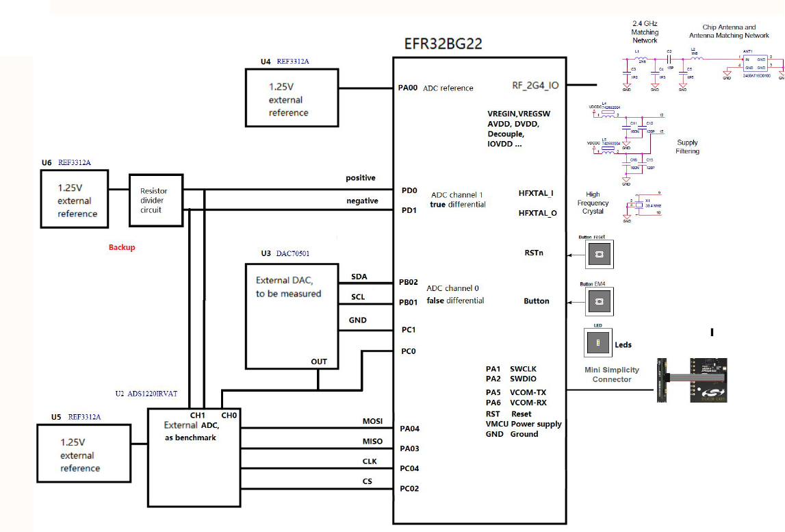
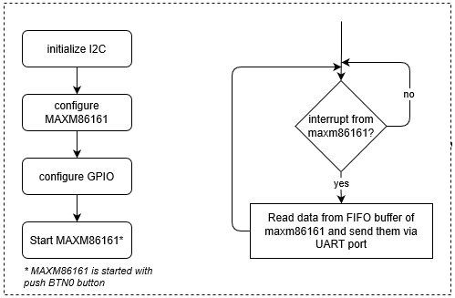

# EFR32BG22 IADC 16-bit ENOB #

## Description ##

The EFR32 Wireless Gecko **Series 2** IADC is an intermediate architecture combining techniques from both **Successive Approximation Register (SAR)** and **Delta-Sigma** style converters. The maximum resolution is 12 bits, which can achieve one million samples per second (1 Msps).  

The flexible incremental architecture uses **oversampling** to allow applications to trade speed for **higher resolution**.  

This example discusses how to attain 14.3-bit **ENOB** with **oversampling**. It also cover offset and gain **calibration** of the IADC with **external reference**.  

**Key points** to attain 14.3 bit ENOB:
- differential mode input
- external reference
- 32+ oversample rate

**Peripherals used**: IADC, GPIO, I2C, USART, EMU, CMU

## Gecko SDK Suite version ##

- Gecko SDK Suite v3.2.1
- MCU v6.1.1.0
- Bluetooth v3.2.1

## Hardware Required ##

- One WSTK [mainboard](https://www.silabs.com/development-tools/wireless/wireless-starter-kit-mainboard)
- One [bgm board](doc/CGM-Board_Schematic.pdf)


- Which includes: 
  - TI 14-bit Voltage-Output DAC [DAC70501](https://www.ti.com/lit/ds/symlink/dac70501.pdf)
  - TI 24-bit Low Power Delta-sigma ADC [ADC1220](https://www.ti.com/lit/ds/symlink/ads1220.pdf)
  - TI Low Drift Voltage Reference [REF3312](https://www.ti.com/product/REF3312)
  - Silabs [EFR32BG22](https://www.silabs.com/documents/public/data-sheets/efr32bg22-datasheet.pdf)
- Schematic for the bgm board

## Setup ##

Connect bgm board with WSTK **mainboard** via **Simplicity 10 pins Adapter**, and connect WSTK main board to PC via **mini USB**.
- Set the debug mode as **OUT**.
- Set **target device** in Simplicity Studio **Launcher->Adapter** as EFR32BG22C224F352GM32.
- Read back the **Secure FW** version.
- Flash the **bootloader** first via **Simplicity commander** or **flash programmer**.
- C:\Sinstal_path\v3.2\platform\bootloader\sample-apps\bootloader-storage-internal-single-512k\efr32mg22c224f512im40-brd4182a

The final **connections** should looks like so:


## Hardware ##

Schematic is [here](doc/CGM-Board_Schematic.pdf)
### Connection Required ###

### Pins Function Map ###

| EFR32BG22 | REF3312       | Direction (wrt BG22) | Comment         |
|-----------|---------------|----------------------|-----------------|
| PA0       | AIN           | IN                   | ADC reference   |
| GND       | GND           |                      |                 |

| EFR32BG22 | ADC Input     | Direction (wrt BG22) | Comment         |
|-----------|---------------|----------------------|-----------------|
| PD0       | AIN           | IN                   | ADC Pos INPUT   |
| PD1       | AIN           | IN                   | ADC Neg INPUT   |
|-----------|---------------|----------------------|-----------------|
| PC0       | IN1           | OUT1                 | ADC INPUT       |
| PC1       | IN2           | OUT2                 | ADC INPUT       |

| EFR32BG22 | ADC1220       | Direction (wrt BG22) | Comment        |
|-----------|---------------|----------------------|----------------|
| PA3       | IN1           | IN                 | SPI MISO       |
| PA4       | IN2           | OUT                 | SPI MOSI       |
| PC4       | IN3           | OUT                 | SPI CLK        |
| PC2       | IN4           | OUT                 | SPI CS         |
| PB0       | IN4           | OUT4                 | SPI INT        |

VCOM, LED, Button, CLK OUT, PTI:
| EFR32BG22 | ADC1220       | Direction (wrt BG22) | Comment        |
|-----------|---------------|----------------------|----------------|
| PA5       | DOUT          | OUT                  | USART0 TX      |
| PA6       | DIN           | IN                   | USART0 EX      |
| NO        | DIN           | OUT                  | SPI INT        |
| PC5       | DIN           | IN                   | button         |
| PC3       | DOUT          | OUT                  | clock out      |


Import the included **.sls** file to **Simplicity STUDIO** then build and flash the project to the bgm board.
In Simplicity Studio select **File->Import** and navigate to the directory with the **.sls** project file.
The project is built with relative paths to the STUDIO_SDK_LOC variable which was defined as

C:\SiliconLabs\SimplicityStudio\v4\developer\sdks\gecko_sdk_suite\v3.2

## How the Project Works ##

The application sits in EM2 until an interrupt occurs. The push buttons on the GG11 Starter Kit is used to start the TIMER and choose a rotation direction. TIMER1 is set to overflow at a frequency of 200 Hz and set to interrupt in an overflow event. In the TIMER1 interrupt handler, the software sets the coils to the next state in order to step the motor. In order to rotate the motor counter-clockwise, the motor coils need to be driven in the following order: Coil 1 -> Coil 3 -> Coil 2 -> Coil 4. In order to rotate the motor clockwise, the motor coils need to be driven in the following order: Coil 4 -> Coil 2 -> Coil 3 -> Coil 1. The calculateSteps() function determines the number of full steps required to rotate by a specified angle. The desired delta angle can be set using the ANGLE_PER_TRIGGER macro. TIMER1 will continue to interrupt until the motor shaft rotates by the desired angle. Once the desired angle is reached, TIMER1 stops and the application waits for the next pushbutton press.

### Memory Layout ###
bootloader + application + nvm3 + ota slot
```
|--------------------------------------------|
|                      nvm3 (24k)            |
|--------------------------------------------|
|              application (464k)            |
|--------------------------------------------|
|                bootloader (24k)            |
 --------------------------------------------
```
current application size is: ~kB

### Software Workflow ###


## API Overview ##
**General**:
| API                                   | Comment                               | 
|---------------------------------------|---------------------------------------|
| void initLetimer(void);               |  -                                    |
| void letimerDelay(uint32_t msec);     | simple delay                          |
| void initButtonEM2(void);             | button in EM2                         |
| void initClockOut(void);              | route clock to pin                    |
| void debounceButton(void);            | button denouncing                     |
| float getDieTemperature(void);        | bg22 emu die temperature              |

**dac70501**:
| API                                             | Comment                                           | 
|-------------------------------------------------|---------------------------------------------------|
| uint16_t dac70501_init(void);                   | dac70501 initialization                           |
| float dac70501_readRef(void);                   | dac70501 voltage read                             |
| uint16_t dac70501_setRef(uint8_t dacValueHigh, uint8_t dacValueLow); | dac70501 output register set |
| uint16_t dac70501_setVolt(float voltValue);     | dac70501 voltage set                              |
| uint16_t dac070501_powerDown(uint8_t dac_pwdwn, uint8_t ref_pwdwn); | dac70501 power down           |
| uint16_t dac70501_reStart(void);                | dac70501 powerup(restart)                         |

**ads1220**:
| API                                             | Comment                      | 
|-------------------------------------------------|------------------------------|
| uint32_t ads1220_init(void);                    | ads1220 initialization       |
| double ads1220_getAdcTemp(void);                | ads1220 temperature          |
| double ads1220_getAdcDataVolt(void);            | ads1220 get voltage          |
| void ads1220_Calibrate(void);                   | ads1220 calibration          |
| void ads1220_powerDown(void);                   | ads1220 power down           |

**efr32bg22 adc**:
| API                                               | Comment                    | 
|---------------------------------------------------|----------------------------|
| void resetIADC(void);                             | bg22 iadc reset            |
| void rescaleIADC(uint32_t newScale);              | bg22 iadc rescale          |
| void initIADC(void);                              | bg22 iadc initialization   |
| void bg22SaveCalData(uint32_t scale);             | bg22 iadc cal data save    |
| void bg22RestoreCalData(void);                    | bg22 iadc cal data restore |
| double iadcPollSingleResult(void);                | bg22 iadc voltage polling  |
| uint32_t iadcDifferentialCalibrate();             | bg22 iadc calibration      |

**global**:
| API                                               | Comment                    | 
|---------------------------------------------------|----------------------------|
| double rmsCal(double buffer[], double adcAve);    | rms calculation            |

**variable**
| variable                                   | Comment                    | 
|--------------------------------------------|----------------------------|
| double buffer[ADC_BUFFER_SIZE];            | buffer to save adc data    |
| double adcGainResult;                      | adc gain cal result        |
| double adcOffsetresult;                    | adc offset cal result      |

## Power Consumption ##
| Components(Peripheral) | Power Up       | Power Down       | Comment         |
|------------------------|----------------|------------------|-----------------|
| REF3312                | 4.9uA          | -                |                 |
| DAC70501               | 1.05mA         | 15uA             | ADC reference   |
| ADC1220                | 15uA           | -                | ADC reference   |
| REF3312 IADC           | 150uA          | 3uA              | ADC reference   |

## .sls Projects Used ##

bluetooth_bgm_iadc.sls

## Steps to Create the Project ##
- add **EFR32BG22C224F352GM32** in **my Products** and select it.
- For EFR32BG22C224F512IM32 (EFR32BG22C112F352GM32), start with **Bluetooth - SoC Empty project**.
- Add software component **Services->IO Stream->IO Stream: USART**. also configure it.
- Add Add **platform->peripheral->iadc**
- Add **platform->peripheral->i2c**
- add folder inc and drv.
- drag the files into the folder.
- add the inc path.
- replace the **app.c**
- **ignore** PTI warning in pintool.

## How to Port to Another Part ##

Open the **Project Properties** and navigate to the **C/C++ Build -> Board/Part/SDK** item. Select the new board or part to target and **Apply** the changes.  
**Note**: 
- There may be dependencies that need to be resolved when changing the target architecture.
- ONLY EFR32/EFM32 S2 support this 16-bit ENOB.

## Testing ##

## How to Test ##
- Run the code
- dump the adc data via **vcom**
- aa
- calcuate the ENOB

## Known **Issues** ##
- bgm failure item
- cgm failure item
- PTI not used
- PC05 use as button (port C/D), not support simple button.
- OTA is not supported, due to flash size limitation. may need lmza to support this on BG22 with 512k flash.

## Reference ##
- DAC70501 [data sheet](https://www.ti.com/lit/ds/symlink/dac70501.pdf)
- ADC1220 [data sheet](https://www.ti.com/lit/ds/symlink/ads1220.pdf)
- REF3312 [data sheet](https://www.ti.com/product/REF3312)
- EFR32BG22 [reference manual](https://www.silabs.com/documents/public/reference-manuals/brd4185a-rm.pdf)
- EFR32BG22 [data sheet](https://www.silabs.com/documents/public/data-sheets/efr32bg22-datasheet.pdf)
- [AN1189](https://www.silabs.com/documents/public/application-notes/an1189-efr32-iadc.pdf): Incremental Analog to Digital Converter (IADC)
- ENOB [calculation](https://www.tij.co.jp/lit/ug/tiduda7/tiduda7.pdf?ts=1630225963102&ref_url=https%253A%252F%252Fwww.google.com%252F)
