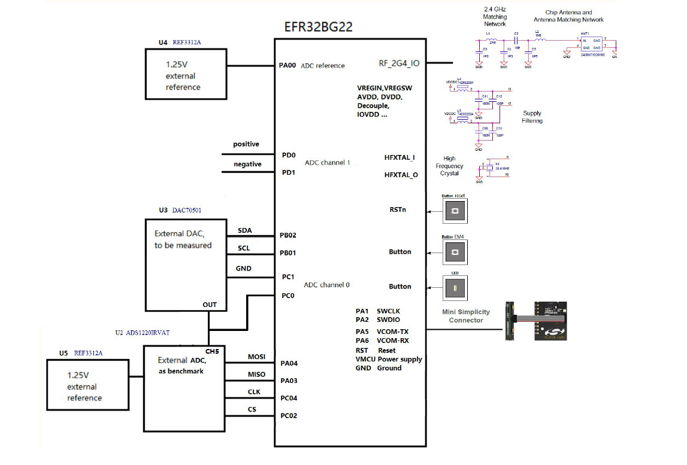
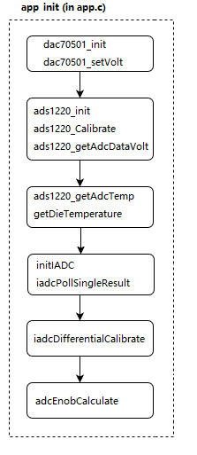
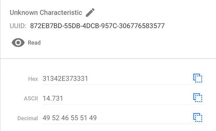

# EFR32BG22 IADC 16-bit ENOB #

## Description ##

The EFR32 Wireless Gecko **Series 2** IADC is an intermediate architecture combining techniques from both **Successive Approximation Register (SAR)** and **Delta-Sigma** style converters. The maximum resolution is 12 bits, which can achieve one million samples per second **speed** (1 Msps).  

The flexible incremental architecture uses **oversampling** to allow applications to trade speed for **higher resolution**.  

This example discusses how to attain 14.3-bit **ENOB** with **oversampling**. It also covers offset and gain **calibration** of the IADC with **external reference**.  
ENOB is calculated based on below **formula**:  
  

**Key points** to attain 14.3 bits ENOB:
- **Differential** mode input
- External **reference**
- 32+ **oversample** rate

**Peripherals used**: IADC, GPIO, I2C, USART, EMU, CMU

## Gecko SDK Suite version ##

- **Gecko SDK Suite** v3.2.1
- MCU v6.1.1.0
- Bluetooth v3.2.1

## Hardware Required ##

- One WSTK [**mainboard**](https://www.silabs.com/development-tools/wireless/wireless-starter-kit-mainboard)
- One [**bgm board**](doc/CGM-Board_Schematic.pdf)


- Which includes: 
  - TI 14-bit Voltage-Output DAC [DAC70501](https://www.ti.com/lit/ds/symlink/dac70501.pdf)
  - TI 24-bit Low Power Delta-sigma ADC [ADC1220](https://www.ti.com/lit/ds/symlink/ads1220.pdf)
  - TI Low Drift Voltage Reference [REF3312](https://www.ti.com/lit/pdf/sbos392)
  - Silicon Labs [EFR32BG22](https://www.silabs.com/documents/public/data-sheets/efr32bg22-datasheet.pdf)

## Setup ##

**Connect** bgm board with WSTK **mainboard** via **Simplicity 10 pins Adapter** and connect WSTK main board to **PC** via **mini USB**.
- Set the **Debug Mode** as **Externa Device (OUT)**.
- Set **Target part** in Simplicity Studio **Launcher->Debug Adapter->Device Configuration->Device hardware** as EFR32BG22C224F352GM32.
- Read the **Secure FW** version.
- Flash the **bootloader** first via **Simplicity Commander** or **Flash Programmer**.
- The pre-build bootloader is in folder like instal_path\v3.2\platform\bootloader\sample-apps\bootloader-storage-internal-single-512k\efr32mg22c224f512im40-brd4182a

The final **connections** should look like so:


## Hardware ##

Schematic is [here](doc/CGM-Board_Schematic.pdf)

### Pins Function Map ###

| EFR32BG22 | Comment          |
|-----------|------------------|
| PA0       |  ADC reference   |
| PD0       |  ADC Pos input   |
| PD1       |  ADC Neg input   |
| PC0       |  ADC Pos input   |
| PC1       |  ADC Neg input   |
| PA3       |  SPI/USART0 MISO |
| PA4       |  SPI/USART0 MOSI |
| PC4       |  SPI/USART0 CLK  |
| PC2       |  SPI/USART0 CS   |
| PA5       |  USART1 TX       |
| PA6       |  USART1 EX       |
| PB0       |  LED             |
| PC5       |  button          |
| PC3       |  clock out       |


## How the Project Works ##

### Memory Layout ###
bootloader + application + nvm3 + lock bytes  
```
|--------------------------------------------|
|                 lock bytes (8k)            |
|--------------------------------------------|
|                      nvm3 (24k)            |
|--------------------------------------------|
|              application (296k)            |
|--------------------------------------------|
|                bootloader (24k)            |
|--------------------------------------------|
```
current application size is: ~kB

### Software Workflow ###


## API Overview ##
**General**:
| API                                   | Comment                               | 
|---------------------------------------|---------------------------------------|
| void initLetimer(void);               |  -                                    |
| void letimerDelay(uint32_t msec);     | simple delay                          |
| void initButtonEM2(void);             | button in EM2                         |
| void initClockOut(void);              | route clock to pin                    |
| float getDieTemperature(void);        | bg22 emu die temperature              |

**dac70501**:
| API                                             | Comment                                           | 
|-------------------------------------------------|---------------------------------------------------|
| uint16_t dac70501_init(void);                   | dac70501 initialization                           |
| float dac70501_readRef(void);                   | dac70501 voltage read                             |
| uint16_t dac70501_setRef(uint8_t dacValueHigh, uint8_t dacValueLow); | dac70501 output register set |
| uint16_t dac70501_setVolt(float voltValue);     | dac70501 voltage set                              |
| uint16_t dac070501_powerDown(uint8_t dac_pwdwn, uint8_t ref_pwdwn); | dac70501 power down           |
| uint16_t dac70501_reStart(void);                | dac70501 power up(restart)                        |

**ads1220**:
| API                                             | Comment                      | 
|-------------------------------------------------|------------------------------|
| uint32_t ads1220_init(void);                    | ads1220 initialization       |
| double ads1220_getAdcTemp(void);                | ads1220 get temperature      |
| double ads1220_getAdcDataVolt(void);            | ads1220 get voltage          |
| void ads1220_Calibrate(void);                   | ads1220 calibration          |
| void ads1220_powerDown(void);                   | ads1220 power down           |

**efr32bg22 adc**:
| API                                             | Comment                      | 
|-------------------------------------------------|------------------------------|
| void resetIADC(void);                           | bg22 iadc reset              |
| void rescaleIADC(uint32_t newScale);            | bg22 iadc rescale            |
| void initIADC(void);                            | bg22 iadc initialization     |
| void bg22SaveCalData(uint32_t scale);           | bg22 iadc cal data save      |
| void bg22RestoreCalData(void);                  | bg22 iadc cal data restore   |
| double iadcPollSingleResult(void);              | bg22 iadc voltage polling    |
| uint32_t iadcDifferentialCalibrate();           | bg22 iadc calibration        |

**global**:
| API                                             | Comment                      | 
|-------------------------------------------------|------------------------------|
| double rmsCal(double buffer[], double adcAve);  | rms calculation              |

**variable**:
| variable                                        | Comment                      | 
|-------------------------------------------------|------------------------------|
| double buffer[ADC_BUFFER_SIZE];                 | buffer to save adc data      |
| double adcGainResult;                           | adc gain cal result          |
| double adcOffsetresult;                         | adc offset cal result        |
| double adcEnobResult;                           | adc enob result              |

## Power Consumption ##
| Components (Peripheral)| Power Up       | Power Down       | Comment         |
|------------------------|----------------|------------------|-----------------|
| REF3312                | 4.9uA          | -                |                 |
| DAC70501               | 1.05mA         | 15uA             | ADC reference   |
| ADC1220                | 15uA           | -                | ADC reference   |
| REF3312 IADC           | 150uA          | 3uA              | ADC reference   |

## .sls Projects Used ##

bluetooth_bgm_iadc.sls

## Steps to Create the Project ##

- add **EFR32BG22C224F352GM32** in **Launcher->My Products** and **select** it.
- Start with **Bluetooth - SoC Empty project**.
- Add software component **Services->IO Stream->IO Stream: USART**, also configure it.
- Add **platform->peripheral->iadc**
- Add **platform->peripheral->i2c**
- Add folder **inc** and **drv**.
- **drag** the source and header files into the folder.
- Add the inc path **C/C++ Build->Settings->Tool Settings->GNU ARC C Compile->Includes->Include paths**.
- **Replace** the **app.c**
- **ignore** PTI warning in **Pintool**.

## How to Port to Another Part ##

Open the **Project Properties** and navigate to the **C/C++ Build -> Board/Part/SDK** item. Select the new **Board** or **Part** to target and **Apply** the changes.  
**Note**: 
- There may be **dependencies** that need to be resolved when changing the target architecture.
- **ONLY** EFR32/EFM32 S2 support this 16-bit ENOB.

## How to Test ##

Import the included **.sls** file to **Simplicity Studio** then **build** and **flash** the project to the bgm board.
In Simplicity Studio select **File->Import** and **navigate** to the directory with the **.sls** project file.
The project is built with **relative paths** to the STUDIO_SDK_LOC variable which was defined as  
C:\SiliconLabs\SimplicityStudio\v4\developer\sdks\gecko_sdk_suite\v3.2

Then:
- **Run** the code in EFR32BG22
- **Open** EFR connect app, **filter** bluetooth_bgm_iadc, **connect** it
- EFR32BG22 **EMU Die Temperature**, UUID **b97a8a77-f1fd-4a13-a492-05360de078cd**, read EFR32BG22 chipset die temperature
- Calibration **Offset** result of ADC (mV), UUID **7489487f-3519-455e-8e1b-1e9dc56c3ba9**
- Calibration **Gain** result of ADC, UUID **4a9e0629-48a0-4a89-9314-6f6c70879c6d**
- ADC calculated **ENOB**, UUID **4a9e0629-48a0-4a89-9314-6f6c70879c6d**  
  
  
  
  

## Known **Issues** ##

- bgm failure item
- cgm failure item
- **PTI** not used
- PC05 use as button (port C/D), not support by **simple button** component.

## Reference ##
- DAC70501 [data sheet](https://www.ti.com/lit/ds/symlink/dac70501.pdf)
- ADC1220 [data sheet](https://www.ti.com/lit/ds/symlink/ads1220.pdf)
- REF3312 [data sheet](https://www.ti.com/lit/pdf/sbos392)
- EFR32BG22 [reference manual](https://www.silabs.com/documents/public/reference-manuals/brd4185a-rm.pdf)
- EFR32BG22 [data sheet](https://www.silabs.com/documents/public/data-sheets/efr32bg22-datasheet.pdf)
- AN1189: Incremental Analog to Digital Converter [(IADC)](https://www.silabs.com/documents/public/application-notes/an1189-efr32-iadc.pdf)
- ENOB [calculation](https://www.tij.co.jp/lit/ug/tiduda7/tiduda7.pdf?ts=1630225963102&ref_url=https%253A%252F%252Fwww.google.com%252F)
